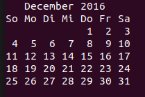

## Just a small version of Linux cal-command in Java. Programmed for my computer science studies.

Please excuse my Java skills. This is my first attempt to program in Java. Comments in code are german.

## Usage
```java
java Cal [month] [year]
```
For month-parameter take the first three letters of the english month name.

